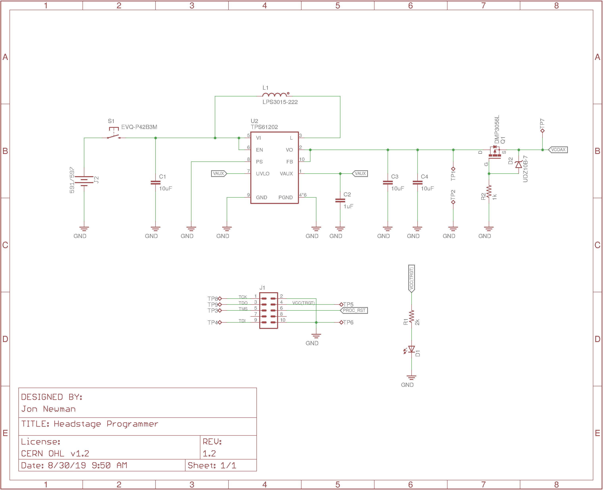

# headstage-programmer
JTAG breakout for the [Intel USB Blaster
2](https://www.digikey.com/short/qqw7hm) used to program the headstages' MAX10
FPGA.

## Schematic

## Purpose
The dense layout required by the headstages in this repository makes exposing a
FPGA programming interface challenging. We have chosen to expose a JTAG
programming interface as a linear, 50 mil pitch array of small copper ["test
points"](https://en.wikipedia.org/wiki/Test_point). This programmer adapter
routes JTAG signals through a set of small ["pogo
pins"](https://en.wikipedia.org/wiki/Pogo_pin) that can reliably make a
temporary electrical connection with the test point array. Additionally, it
contains a AAA battery and boost converter to generate power for the headstage
during programming and to illuminate a white LED on the bottom of the board
that eases pogo-pin/test-point alignment.

## Gerber Files


## BOM
The BOM is located on [this google
sheet](https://docs.google.com/spreadsheets/d/1F-KWcdvH_63iXjZf0cgCfDiFX6XXW3qw6rlR8DZrFpQ/edit#gid=673969549).
